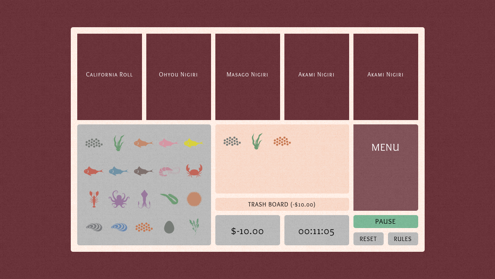
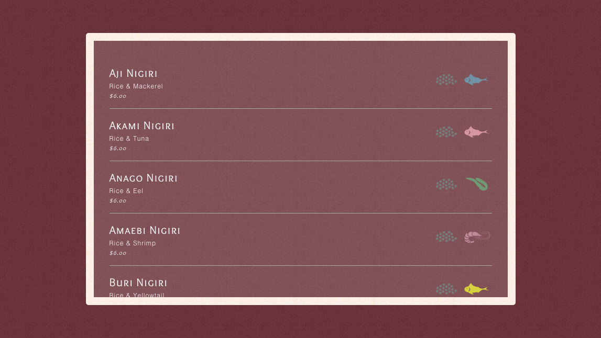

# Sushi Game

[ jessicaganji.com/sushi ](http://jessicaganji.com/sushi)

#### Technologies Used

* HTML5 + CSS3
* JavaScript + jQuery
* Adobe Creative Cloud (Photoshop & Illustrator)

#### Screenshots

#### Rules 

1. Click Start to run the timer and show your sushi orders.

2. Click on the Menu in order to see what ingredients are necessary for your sushi.

3. Click on the necessary ingredients (order matters) and then click the sushi card. If you selected the correct ingredients, you will collect your payment. If you select the wrong ingredients, you will have to clear the board and loose ten dollars.

4. Play Again

#### User Stories

| As a .. | I can.. |
|---------|---------|
| Player | learn about sushi by memorizing popular sushi combinations |
| Player | click start to begin the game |
| Player | check out order options, mentally select one out of five options |
| Player | click on the menu and find the correct recipe |
| Player | click menu background to go back to gameboard |
| Player | click on the necessary ingredients for your desired order |
| Player | click on the order ticket when you have completed putting your ingredients on the board |
| Player | enjoy animated gifs |
| Player | trash my board by clicking the "TRASH BOARD" button |
